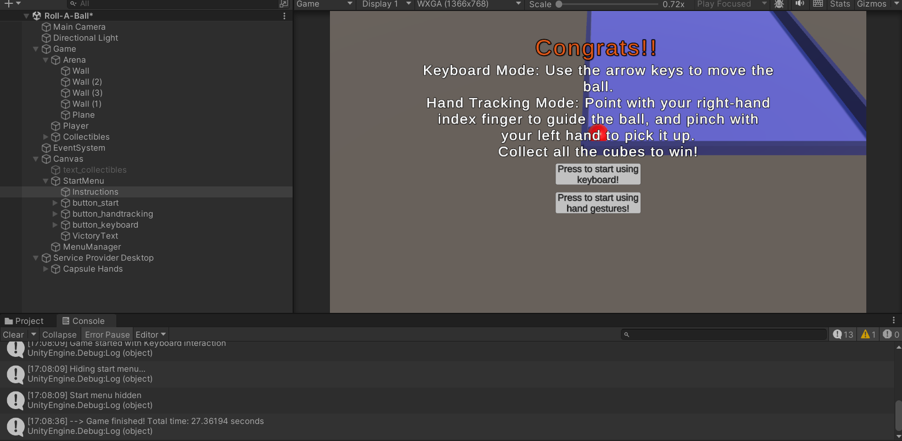
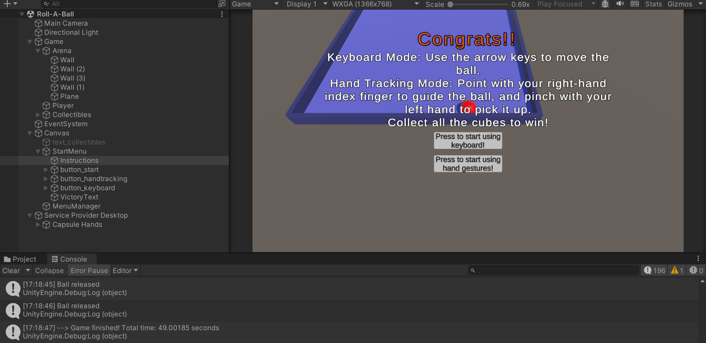

Write in your report one or two paragraphs describing your problem statement. Specifically, write the (simple) research question you aim to answer with your study, describe the independent variables you will be controling, the dependent variables you will be measuring. Discuss possible parasite variables and how you would control them. Finally, specify you hypothesis based on your variables.

## Problem Statement

The aim of this study is to investigate which interaction method provides better user performance in a 3D object collection task within a virtual environment. Our research question is: **"How does the interaction method (keyboard control vs. Leap Motion hand tracking) affect user performance when collecting objects in the Roll-A-Ball game?"**

### Independent Variables

The independent variable in this experiment is the **interaction method**, which will be controlled by implementing two distinct input modalities: traditional keyboard-based WASD/arrow controls and Leap Motion hand gesture tracking. The dependent variables we will measure include **completion time** (time taken to collect all 12 objects), and **user satisfaction** (subjective rating on ease of use and comfort). 

### Parasite Variables

Potential parasite variables that could affect results include participants' prior gaming experience, familiarity with either input method, hand dominance for gesture-based interaction, and learning effects from repeated trials. 

Based on existing literature on natural user interfaces, we hypothesize that *Leap Motion hand tracking will result in higher user satisfaction scores due to its intuitive nature, but keyboard controls will demonstrate superior performance in terms of completion time and accuracy due to the precision and familiarity of traditional input methods*. 

## Why is the tutorial important?
To give a fair chance of everyone unconnected to their previous experience, and to help them get used to the physics and controls of the game. This doesn't reduce the advantage experienced gamers might have over casual users, but gives an equal starting field to everyone.

- Reduces learning effects during data collection
- Ensures participant comfort with the interface
- Provides consistent baseline for all participants
- Eliminates confounding variables from unfamiliarity
- Allows natural mode selection point in the experiment

## 📊 Pilot Study Results

| Participant | Keyboard (s) | Leap Motion (s) |
|--------------|--------------|----------------|
| User 1 | 27.36 | 49.00 |
| User 2 | 30.22 | 39.77 |

**Average Completion Time:**  
- **Keyboard:** 28.79 seconds  
- **Leap Motion:** 44.39 seconds  

### 🧠 Observation
Participants consistently completed the task faster using **keyboard controls**, which offered more precise and responsive movement.  
The **Leap Motion** interface required more time, as it was **harder to control the ball precisely** with hand gestures.  
However, both users reported that **Leap Motion felt more engaging and enjoyable**, indicating **higher user satisfaction** despite slower performance.

---

## ⚠️ Unexpected Problems
- **Tracking Loss:** Hands occasionally left the Leap Motion’s field of view.   
- **Learning Curve:** Difficulty coordinating pointing and pinching gestures.  
- **Comfort:** Mild arm fatigue after extended Leap Motion use.

---

## 🧪 Importance of Pilot Studies
Conducting a pilot study is crucial because it allows researchers to:
- Identify **technical or procedural issues** early.  
- Ensure **timing and data logging systems** work correctly.  
- Verify the **difficulty level** is appropriate.  
- Detect **unintended participant behavior** or confusion.  
- Estimate **data variability** for better study design and statistical planning.

## 🧾 Summary
The pilot results support the hypothesis that **keyboard controls provide faster and more precise performance**,  
while **Leap Motion offers a more immersive and enjoyable experience**.  

The pilot successfully identified areas for improvement, confirming that refinements are needed before conducting the main experiment.

---

## 🖼️ Screenshots

### Results: Time for user1 using Keyboard

### Results: Time for user1 using hand gestures

### Results: Time for user2 using Keyboard

### Results: Time for user2 using hand gestures
